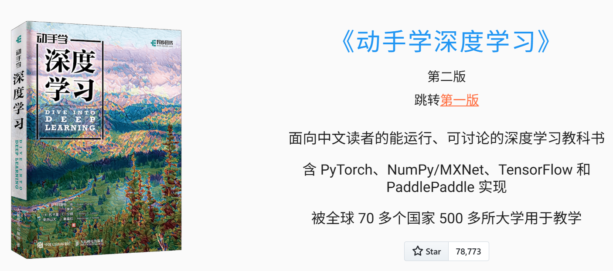
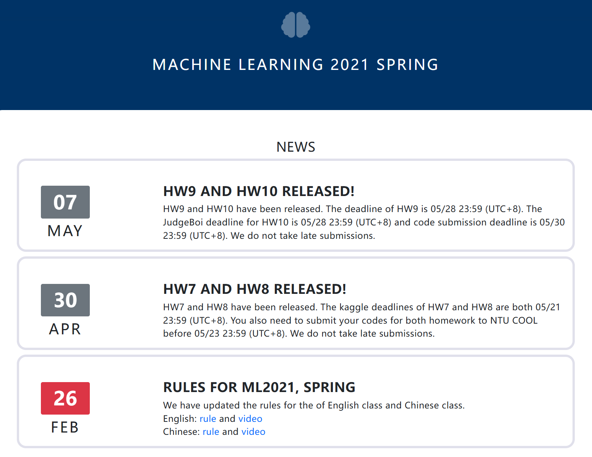

<div align="center">

# DeepLearning-Beginner-Skill

> *两门经典深度学习课程 · 统一结构化 Skill · 从新手入门到进阶体系*
>
> `深度学习` · `Deep Learning` · `PyTorch` 

[](LICENSE)
[](https://claude.ai/code)
[](chapters/)
[](books/)

  
  

**蒸馏李宏毅 + 李沐两门经典深度学习课程，构建从入门到进阶的完整知识体系**

`LeeDL_Tutorial` 新手入门 · `d2l-zh-pytorch` 动手实践

</div>

---

## 目录

- [概述](#概述)
- [知识体系](#知识体系)
- [仓库结构](#仓库结构)
- [安装与使用](#安装与使用)
- [两本教材对比](#两本教材对比)
- [学习路径建议](#学习路径建议)

---

## 概述

本仓库将两门中文深度学习经典课程（李宏毅《深度学习教程》v1.2.4 + 李沐《动手学深度学习》PyTorch 2.0.0）蒸馏为**统一的、结构化**的 Claude Code Skill 知识库，覆盖从零基础数学预备到 ChatGPT、扩散模型、强化学习、视觉 RL 的完整知识体系。两书内容重叠部分融合为统一章节，各自独有的进阶主题作为独立章节保留 — 共 24 章。

| 教材 | 角色 | 框架 | 原书页数 | 特色 |
|------|------|------|----------|------|
| 李宏毅《深度学习教程》v1.2.4 | 新手入门，概念讲解/框架/直觉优先 | PyTorch | ~400+ | 框架化思维、3-step ML 范式、对抗攻击/RL/元学习/ChatGPT |
| 李沐《动手学深度学习》PyTorch 2.0.0 | 动手实践，代码驱动/从零实现 | PyTorch + d2l | ~600+ | 逐层手写实现、CNN/RNN/Transformer/目标检测/分割/NLP |

---

## 知识体系

### 全景图

```
┌──────────────────────────────────────────────────────────────────┐
│                    DeepLearning-Beginner-Skill                    │
│                         24 章 · 统一知识库                         │
├─────────────────┬──────────────────────┬─────────────────────────┤
│   基础层 (5 章)   │   核心层 (9 章)       │   进阶层 (10 章)          │
├─────────────────┼──────────────────────┼─────────────────────────┤
│ Ch 1  机器学习基础 │ Ch 6  实践方法论       │ Ch 15 生成模型 (GAN)      │
│ Ch 2  数学预备    │ Ch 7  优化算法        │ Ch 16 扩散模型             │
│ Ch 3  线性模型    │ Ch 8  正则化与泛化     │ Ch 17 自监督与表示学习      │
│ Ch 4  多层感知机  │ Ch 9  CNN 基础       │ Ch 18 对抗攻击与鲁棒性      │
│ Ch 5  深度学习计算 │ Ch 10 现代 CNN 架构   │ Ch 19 迁移学习             │
│                  │ Ch 11 循环神经网络    │ Ch 20 强化学习             │
│                  │ Ch 12 注意力/Transformer│ Ch 21 元学习与终身学习     │
│                  │ Ch 13 计算机视觉      │ Ch 22 网络压缩与可解释性 AI  │
│                  │ Ch 14 自然语言处理    │ Ch 23 ChatGPT 与大语言模型  │
│                  │                      │ Ch 24 MineCraft 视觉 RL    │
└─────────────────┴──────────────────────┴─────────────────────────┘
```

### 知识点交叉覆盖

| 主题 | LeeDL (李宏毅) | d2l (李沐) | 对应章 |
|------|:---:|:---:|:---:|
| ML 三步骤 / 训练范式 | 第 1 讲 | Ch 1-4 | Ch 1 |
| 数学预备 (线代/概率/微积分) | 第 2 讲 | Ch 2-4 | Ch 2 |
| 线性回归 / Softmax 分类 | 第 3 讲 | Ch 3-4 | Ch 3 |
| MLP / 激活函数 / GPU | 第 4 讲 | Ch 5-12 | Ch 4 |
| autograd / nn.Module / DataLoader | 第 5-7 讲 | Ch 5-8 | Ch 5 |
| 训练方法论 / 超参调优 | 第 8 讲 | Ch 13 | Ch 6 |
| SGD / Adam / 学习率调度 | 第 5 讲 | Ch 12 | Ch 7 |
| BN / Dropout / Weight Decay | 第 6 讲 | Ch 5,7,13 | Ch 8 |
| CNN / 池化 / 多通道 | 第 10 讲 | Ch 7-8 | Ch 9 |
| AlexNet / VGG / ResNet / DenseNet | 第 10 讲 | Ch 8-9 | Ch 10 |
| RNN / LSTM / GRU | 第 9 讲 | Ch 10 | Ch 11 |
| Transformer / 自注意力 | 第 11 讲 | Ch 11 | Ch 12 |
| 数据增强 / 目标检测 / 语义分割 | — | Ch 14-15 | Ch 13 |
| word2vec / BERT / 微调 | 第 13 讲 | Ch 15-16 | Ch 14 |
| GAN / WGAN / Cycle GAN | 第 14 讲 | Ch 17 | Ch 15 |
| DDPM / Stable Diffusion / CFG | 第 16 讲 | — | Ch 16 |
| BERT MLM / GPT / 自编码器 | 第 12 讲 | Ch 15-16 | Ch 17 |
| FGSM / 白盒黑盒攻击 / 对抗训练 | 第 12 章 | — | Ch 18 |
| 领域自适应 / 领域泛化 | 第 13 章 | — | Ch 19 |
| 策略梯度 / Actor-Critic / RL | 第 14 章 | — | Ch 20 |
| MAML / 小样本学习 / 终身学习 | 第 15-16 章 | — | Ch 21 |
| 剪枝 / 蒸馏 / 量化 / XAI | 第 17-18 章 | — | Ch 22 |
| ChatGPT / GPT 演进 / RLHF | 第 19 章 | — | Ch 23 |
| LS-Imagine 视觉 RL | 第 20 章 | — | Ch 24 |

---

## 仓库结构

```
.
├── CLAUDE.md                          # 仓库说明与操作指引
├── README.md                          # 本文件
├── SKILL.md                           # 主索引（核心框架 · 24 章索引 · 主题索引）
│
├── chapters/                          # 核心产出 —— 24 章独立知识单元
│   ├── ch01-机器学习基础.md
│   ├── ch02-数学预备.md
│   ├── ch03-线性模型与从零实现.md
│   ├── ch04-多层感知机.md
│   ├── ch05-深度学习计算.md
│   ├── ch06-实践方法论.md
│   ├── ch07-优化算法.md
│   ├── ch08-正则化与泛化.md
│   ├── ch09-卷积神经网络基础.md
│   ├── ch10-现代CNN架构.md
│   ├── ch11-循环神经网络.md
│   ├── ch12-注意力机制与Transformer.md
│   ├── ch13-计算机视觉.md
│   ├── ch14-自然语言处理.md
│   ├── ch15-生成模型.md
│   ├── ch16-扩散模型.md
│   ├── ch17-自监督学习与表示学习.md
│   ├── ch18-对抗攻击与模型鲁棒性.md
│   ├── ch19-迁移学习.md
│   ├── ch20-强化学习.md
│   ├── ch21-元学习与终身学习.md
│   ├── ch22-网络压缩与可解释性AI.md
│   ├── ch23-ChatGPT与大语言模型.md
│   └── ch24-MineCraft纯视觉强化学习案例.md
│
├── glossary.md                        # ~100 术语字母排序，每术语带归属章节
├── patterns.md                        # 25 个可复用的设计模式/技术方案
├── cheatsheet.md                      # 速查：决策树 · 模型选型 · 损失函数 · 优化器 · 超参默认
├── code/                              # 李宏毅课程 15 次课后作业 + labml.ai 经典网络逐行注释实现
└── books/                             # 原始教材 + MinerU 解析产物
    ├── d2l-zh-pytorch.pdf             # 动手学深度学习 原版 PDF (~30MB)
    ├── LeeDL_Tutorial_v.1.2.4.pdf     # 李宏毅深度学习教程 原版 PDF (~136MB)
    ├── d2l-zh-pytorch-md/             # MinerU 解析版（含 images/）
    │   └── d2l-zh-pytorch.md          # 单文件 ~25,700 行
    └── LeeDL_Tutorial_v.1.2.4/        # MinerU 解析版（含 images/）
        └── auto/
            └── LeeDL_Tutorial_v.1.2.4.md  # 单文件 ~5,300 行
```

---

## 安装与使用

### 安装

```bash
# 方式 1: 使用 npx（推荐）
npx skills add MaybeBio/DeepLearning-Beginner-Skill -a claude-code

# 方式 2: 手动克隆
git clone https://github.com/MaybeBio/DeepLearning-Beginner-Skill ~/.claude/skills/
```

### 在 Claude Code 中调用

Skill 加载后，可直接在对话中查询或手动触发 `/DeepLearning-Beginner-Skill`：

```
▸ 什么是 Batch Normalization？它为什么有效？
▸ BERT 和 GPT 的核心区别是什么？
▸ 训练不收敛怎么排查？给出故障决策树
▸ Stable Diffusion 的 CFG 参数 w=7.5 是什么意思？
▸ 给我写一个 GAN 训练的 PyTorch 代码模板
▸ 知识蒸馏中的温度 T 怎么调？为什么需要 T>1？
▸ 强化学习的 on-policy 和 off-policy 有什么区别？
```

### 查询路由

| 查询类型 | 目标文件 | 响应特征 |
|----------|----------|----------|
| 概念快速理解 | `glossary.md` | 精确定义 + 归属章节 |
| 代码实现参考 | `chapters/*.md` | 完整 PyTorch 代码 + 说明 |
| 模型/方法选型决策 | `cheatsheet.md` | 决策树 / 对比矩阵 / 默认超参 |
| 解决具体技术问题 | `patterns.md` | When / How / Trade-offs |
| 系统学习一个主题 | `chapters/*.md` + `SKILL.md` | Core Idea → Framework → Code → 实例 |

### 每章结构

每章按统一模板组织，支持快速定位：

| 区域 | 内容 |
|------|------|
| **Core Idea** | 1-2 句概括本章核心 |
| **Frameworks Introduced** | 命名框架 → 适用场景 → 操作步骤 → 关键点 |
| **Key Concepts** | 术语定义（5-10 个） |
| **Mental Models** | 直觉类比（"把 X 想象成 Y"） |
| **Anti-patterns** | 常见错误做法 + 为什么 + 正确做法 |
| **Code Examples** | 可运行的 PyTorch 代码模板 |
| **Reference Tables** | 对比矩阵 / 超参表 / 方法对照 |
| **Worked Example** | 一个完整的、走通全流程的案例 |
| **Key Takeaways** | 3-7 条必须记住的结论 |
| **Connects To** | 与其他章节/外部概念的关联 |

---

## 两门课程对比

| 维度 | LeeDL (李宏毅) | d2l (李沐) |
|------|:---:|:---:|
| **定位** | 新手友好，直觉优先 | 动手实践，代码驱动 |
| **教学特色** | 框架化思维、3-step ML 范式、故障决策树 | 逐层手写实现、线性代数→CNN→Transformer 递进 |
| **代码风格** | 简化示例，突出原理 | 完整可运行，d2l 工具包 |
| **数学要求** | 低 | 中 |
| **独特内容** | 对抗攻击、元学习、终身学习、ChatGPT、视觉 RL | 目标检测(锚框/NMS/SSD/R-CNN)、语义分割(FCN/U-Net) |
| **最适合** | 建立 ML 直觉框架、理解"为什么" | 写出可运行代码、掌握工程实现 |

---

## 参考代码资源

| 目录 | 说明 |
|------|------|
| `code/leedl-tutorial/Leedl_HW/` | https://github.com/datawhalechina/leedl-tutorial/tree/master/Homework, 李宏毅深度学习课程 15 次课后作业，覆盖回归→CNN→Transformer→GAN→BERT→RL→元学习，含完整 ipynb 代码课件 |
| `annotated_deep_learning_paper_implementations` | [labml.ai](https://github.com/labmlai/annotated_deep_learning_paper_implementations) 经典网络架构逐行注释实现，涵盖 Transformer/GPT/ViT/DDPM/Stable Diffusion/ResNet/LSTM/RL 等 |

---

## 参考教材

| 教材 | 作者 | 年份 | 参考网址 |
|------|------|------| ---- |
| 《深度学习教程》v1.2.4 | 李宏毅 | 2024 | https://github.com/datawhalechina/leedl-tutorial |
| 《动手学深度学习》第二版 PyTorch 2.0.0 | Aston Zhang, Zachary C. Lipton, Mu Li, Alexander J. Smola | 2023 | https://zh.d2l.ai/ |

---

<div align="center">

*基于课程原文蒸馏，保留术语精确性与代码完整性。24 章统一模板，按需加载，渐进式深入。*

[Report Issue](https://github.com/MaybeBio/DeepLearning-Beginner-Skill/issues) ·
[Suggest Improvement](https://github.com/MaybeBio/DeepLearning-Beginner-Skill/issues/new)

</div>
